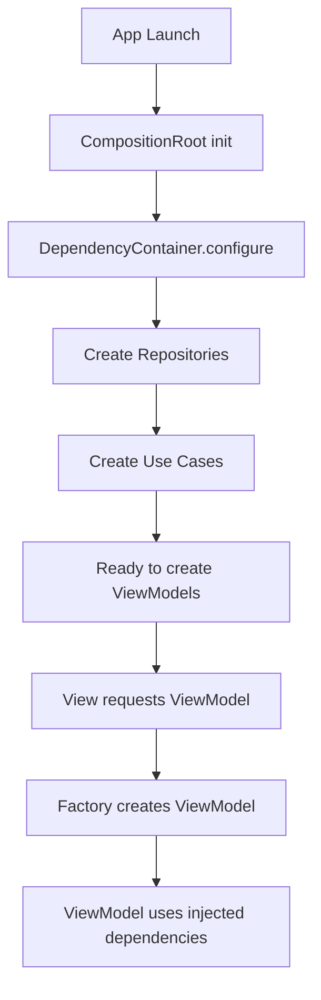

# 💉 Sistema de Inyección de Dependencias

Este documento describe el sistema de inyección de dependencias (DI) implementado en JackSSH.

## 🎯 Objetivos

- ✅ **Desacoplamiento**: Separar la creación de objetos de su uso
- ✅ **Testabilidad**: Facilitar el testing con mocks
- ✅ **Centralización**: Un único lugar para configurar dependencias
- ✅ **Type Safety**: Compilador verifica las dependencias
- ✅ **Lazy Loading**: Instancias creadas bajo demanda

## 🏗️ Arquitectura

```
┌─────────────────────────────────────────┐
│        DependencyContainer              │
│  (Singleton, Thread-Safe, MainActor)    │
├─────────────────────────────────────────┤
│                                         │
│  Repositories:                          │
│  - authRepository                       │
│  - hostRepository                       │
│  - secretStore                          │
│  - homeStatusRepository                 │
│                                         │
│  Use Cases:                             │
│  - loadHosts                            │
│  - saveHost                             │
│  - deleteHost                           │
│  - loadHomeStatus                       │
│                                         │
│  Services:                              │
│  - sshConnector                         │
│  - terminalConnecting                   │
│                                         │
│  ViewModels (Factories):                │
│  - makeAuthViewModel()                  │
│  - makeHomeViewModel()                  │
│  - makeHostsViewModel()                 │
│  - makeTerminalViewModel(hostID:)       │
│                                         │
└─────────────────────────────────────────┘
           ↓
┌─────────────────────────────────────────┐
│        CompositionRoot                  │
│  (Configura y expone ViewModels)        │
└─────────────────────────────────────────┘
           ↓
┌─────────────────────────────────────────┐
│        JackSshApp                       │
│  (Entry point de la app)                │
└─────────────────────────────────────────┘
```

## 📖 Uso Básico

### 1. Configuración Inicial (App Entry Point)

```swift
@main
struct JackSshApp: App {
    @State private var composition = CompositionRoot()
    
    var body: some Scene {
        WindowGroup {
            RootView(
                authViewModel: composition.authViewModel,
                router: composition.router,
                homeViewModel: composition.homeViewModel,
                hostsDependencies: composition.hostsDependencies
            )
        }
        .modelContainer(composition.modelContainer)
    }
}
```

### 2. Inyección en Views (Método 1: Constructor)

```swift
public struct LoginView: View {
    @State private var viewModel: AuthViewModel
    
    public init(viewModel: AuthViewModel) {
        _viewModel = State(initialValue: viewModel)
    }
    
    public var body: some View {
        // UI que usa viewModel
    }
}

// Uso:
LoginView(viewModel: composition.authViewModel)
```

### 3. Inyección en Views (Método 2: Environment)

```swift
public struct SomeView: View {
    @Environment(\.dependencies) private var dependencies
    
    public var body: some View {
        Button("Login") {
            let viewModel = dependencies.makeAuthViewModel()
            // Usar viewModel
        }
    }
}
```

### 4. Inyección en Views (Método 3: Property Wrapper)

```swift
public struct SomeView: View {
    @InjectedViewModel var authViewModel: AuthViewModel
    
    public var body: some View {
        Text("User: \(authViewModel.email)")
    }
}
```

## 🔧 Componentes del Sistema

### DependencyContainer

Contenedor singleton que gestiona todas las dependencias.

```swift
let container = DependencyContainer.shared
container.configure(inMemory: false)

// Acceder a repositorios
let authRepo = container.authRepository
let hostRepo = container.hostRepository

// Crear ViewModels
let authVM = container.makeAuthViewModel()
let hostsVM = container.makeHostsViewModel()
```

### CompositionRoot

Punto de composición que usa `DependencyContainer` internamente.

```swift
let composition = CompositionRoot(inMemory: false)

// ViewModels principales
let authViewModel = composition.authViewModel
let homeViewModel = composition.homeViewModel
```

### ViewModelFactory

Factory accesible desde el Environment para crear ViewModels bajo demanda.

```swift
@Environment(\.viewModelFactory) private var factory

// Crear ViewModels
let authVM = factory.makeAuthViewModel()
let terminalVM = factory.makeTerminalViewModel(hostID: uuid)
```

## 📝 Ejemplos Completos

### Ejemplo 1: Login Flow

```swift
// 1. En App.swift
@main
struct JackSshApp: App {
    @State private var composition = CompositionRoot()
    
    var body: some Scene {
        WindowGroup {
            AuthFlowView(authViewModel: composition.authViewModel)
        }
    }
}

// 2. En AuthFlowView.swift
public struct AuthFlowView: View {
    @State private var authViewModel: AuthViewModel
    @State private var currentStep: AuthStep = .welcome
    
    public init(authViewModel: AuthViewModel) {
        _authViewModel = State(initialValue: authViewModel)
    }
    
    public var body: some View {
        switch currentStep {
        case .signIn:
            LoginView(
                viewModel: authViewModel,
                onSuccess: { /* ... */ }
            )
        case .signUp:
            SignUpView(
                viewModel: authViewModel,
                onSuccess: { /* ... */ }
            )
        }
    }
}
```

### Ejemplo 2: Hosts List

```swift
// 1. En CompositionRoot
private func makeHostsDependencies() -> HostsDependencies {
    HostsDependencies(
        makeListViewModel: { [dependencies] in
            dependencies.makeHostsViewModel()
        }
    )
}

// 2. En HostsListView
public struct HostsListView: View {
    @State private var viewModel: HostsViewModel
    
    init(makeViewModel: () -> HostsViewModel) {
        _viewModel = State(initialValue: makeViewModel())
    }
    
    var body: some View {
        List(viewModel.hosts) { host in
            // ...
        }
        .task {
            await viewModel.load()
        }
    }
}
```

### Ejemplo 3: Terminal Session

```swift
// Factory con parámetros
let terminalVM = dependencies.makeTerminalViewModel(hostID: hostID)

// Uso en View
TerminalView(viewModel: terminalVM)
```

## 🧪 Testing

### Configuración para Tests

```swift
import XCTest
@testable import JackSsh

final class AuthViewModelTests: XCTestCase {
    var container: DependencyContainer!
    var sut: AuthViewModel!
    
    override func setUp() {
        super.setUp()
        
        // Configurar container con mocks
        container = DependencyContainer.shared
        container.configure(inMemory: true)
        
        // Inyectar mock repository
        let mockAuthRepo = MockAuthRepository()
        container.setAuthRepository(mockAuthRepo)
        
        // Crear ViewModel bajo test
        sut = container.makeAuthViewModel()
    }
    
    override func tearDown() {
        container.reset()
        super.tearDown()
    }
    
    func testLogin() async {
        // Given
        sut.email = "test@example.com"
        sut.password = "password123"
        
        // When
        await sut.login()
        
        // Then
        XCTAssertEqual(sut.authState, .authenticated(mockUser))
    }
}
```

### Mock Repositories

```swift
final class MockAuthRepository: AuthRepository {
    var signInCalled = false
    var shouldSucceed = true
    
    func signIn(email: String, password: String) async throws -> User {
        signInCalled = true
        
        if shouldSucceed {
            return User(
                id: UUID(),
                email: email,
                createdAt: Date()
            )
        } else {
            throw NSError(domain: "Auth", code: 401)
        }
    }
    
    // Implementar otros métodos...
}
```

## 🎓 Mejores Prácticas

### ✅ DO (Hacer)

1. **Usar el Container para crear ViewModels**
   ```swift
   let viewModel = dependencies.makeAuthViewModel()
   ```

2. **Pasar ViewModels por constructor**
   ```swift
   LoginView(viewModel: authViewModel)
   ```

3. **Configurar dependencias solo en CompositionRoot**
   ```swift
   // Solo en CompositionRoot.swift
   dependencies.configure(inMemory: false)
   ```

4. **Usar lazy loading para propiedades costosas**
   ```swift
   private(set) lazy var authRepository: AuthRepository = {
       makeAuthRepository()
   }()
   ```

5. **Crear factories para ViewModels con parámetros**
   ```swift
   func makeTerminalViewModel(hostID: UUID) -> TerminalViewModel
   ```

### ❌ DON'T (No hacer)

1. **No crear repositorios directamente en Views**
   ```swift
   // ❌ MAL
   let repo = SupabaseAuthRepository(...)
   
   // ✅ BIEN
   @Environment(\.dependencies) var dependencies
   let repo = dependencies.authRepository
   ```

2. **No usar singletons para ViewModels**
   ```swift
   // ❌ MAL
   static let shared = AuthViewModel(...)
   
   // ✅ BIEN
   let viewModel = dependencies.makeAuthViewModel()
   ```

3. **No configurar el container en múltiples lugares**
   ```swift
   // ❌ MAL (en View)
   dependencies.configure(inMemory: true)
   
   // ✅ BIEN (solo en App/CompositionRoot)
   ```

4. **No acceder a dependencias concretas fuera de DependencyContainer**
   ```swift
   // ❌ MAL
   let repo = SwiftDataHostRepository(...)
   
   // ✅ BIEN
   let repo: HostRepository = dependencies.hostRepository
   ```

## 🔄 Ciclo de Vida



## 📊 Beneficios

1. **Testabilidad**: Fácil inyectar mocks
2. **Mantenibilidad**: Cambios centralizados
3. **Claridad**: Dependencias explícitas
4. **Flexibilidad**: Fácil cambiar implementaciones
5. **Performance**: Lazy loading de recursos costosos

## 🚀 Próximos Pasos

- [ ] Añadir más mocks para testing
- [ ] Implementar DI para Analytics
- [ ] Añadir logging de creación de dependencias
- [ ] Crear helpers para testing con DI
- [ ] Documentar patterns para nuevos módulos

---

**Implementado**: 12 de julio, 2026  
**Versión**: 1.0.0  
**Mantenedor**: JackSSH Team
